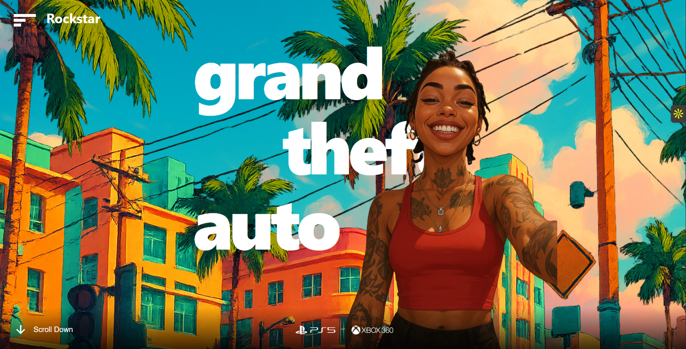

# 🌴 GTA VI - Animated Landing Page Concept

A high-performance, interactive landing page concept for Grand Theft Auto VI. This project demonstrates advanced frontend techniques using **React**, **GSAP (GreenSock)**, and **Tailwind CSS** to create immersive entrance animations and parallax effects.

 

## ✨ Features

- ** cinematic Loading Sequence:** A custom SVG mask animation that transitions from the "VI" logo into the full site.
- **🖱️ Mouse Parallax Effect:** Background layers (Sky, City, Character) move at different speeds relative to mouse movement to create 3D depth.
- **🎬 Advanced GSAP Timelines:** Complex sequencing for entrance animations, scaling, and rotation resets.
- **📱 Responsive scaling:** Character and background assets scale dynamically using Viewport Units (`vh`/`vw`) to maintain perfect layout on different screen sizes.
- **🎨 Modern Styling:** Built with Tailwind CSS for rapid, responsive styling and absolute positioning.

## 🛠️ Tech Stack

- **Framework:** [React.js](https://react.dev/) (Vite)
- **Styling:** [Tailwind CSS](https://tailwindcss.com/)
- **Animations:** [GSAP](https://gsap.com/) (GreenSock Animation Platform) + `@gsap/react`
- **Icons:** [Remix Icon](https://remixicon.com/)

## 🚀 Getting Started

Follow these steps to set up the project locally on your machine.

### Prerequisites

Make sure you have Node.js installed.

### Installation

1. **Clone the repository**
   ```bash
   git clone [https://github.com/your-username/gta-vi-landing.git](https://github.com/your-username/gta-vi-landing.git)
   cd gta-vi-landing
Install dependencies

Bash

npm install
Run the development server

Bash

npm run dev
Open your browser to http://localhost:5173 (or the port shown in your terminal).

📂 Project Structure
src/
├── App.jsx        # Main component containing all GSAP logic and layout
├── index.css      # Tailwind directives and global resets
├── assets/        # (Optional) Store your static images here
└── main.jsx       # Entry point
public/
├── bg.png         # Background city layer
├── sky.png        # Sky layer for parallax
├── girlbg.png     # Main character asset
├── imag.png       # Content section image
└── ps5.png        # PlayStation logo
🧠 Key Animation Logic
1. The Mask Loader
We use an SVG <mask> to create the "VI" text cutout. GSAP animates the scale of this mask to 10x, effectively revealing the website "through" the text.

JavaScript

tl.to(".vi-mask-group", {
  scale: 10,
  duration: 2,
  ease: "Expo.easeInOut",
});
2. The Parallax Effect
We track mousemove events on the main container and calculate a normalized value (-1 to 1). We then apply different multipliers to the layers:

Text: Moves slightly (x * 0.4)

Sky: Moves moderately (x * 1)

City Background: Moves heavily (x * 1.7)

⚠️ Disclaimer
This is a non-commercial fan project created for educational purposes. All image assets (GTA VI, characters, logos) are property of Rockstar Games.

📄 License
Distributed under the MIT License. See LICENSE for more information.
